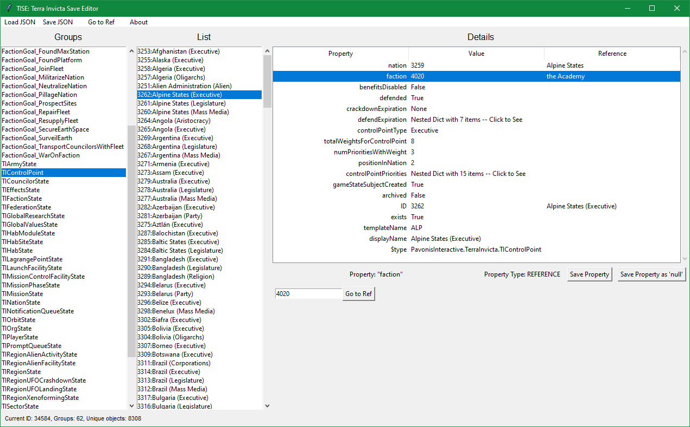

# TISE: Terra Invicta Save Editor

Howdy. This is a save game editor for Terra Invicta. This tool uses Python and tkinter to help display and modify uncompressed save files.

### Disclaimer

This software is provided as-is. Please ensure you backup your save files before making changes to avoid any loss of data. Use at your own risk.

## Features

- Supports ALL object types within Terra Invicta. Load any object in your save game for editing.
- All data types are editable! Dictionaries have some display help for editing as well. For complex objects such as lists or nested dictionaries, they are modifyable in their raw JSON format.
- Specific support for TI object types:
  - Faction opinion/influence percentages ("publicOpinion" within a "TINationState" object): Will auto-calculate the "undecided" percentage to ensure they all add up to 1.
- References to other objects include a handy "Go to Ref" button to auto-navigate you to them.
- Saved game formatting should be 1:1 identical to original save files, including quirks.

## Usage

Get the latest `tise.exe` from the GitHub Releases ->

Within Terra Invicta itself, make sure that your saves are _uncompressed_:


To start editing your Terra Invicta save game file, click "Load JSON", open your save game. You can then navigate through the different groups of game objects.

### Public Opinion editing example

For example, to edit a nation, select "TINationState", pick a nation, then to edit public opinion for each faction, select the item "publicOpinion":


There's no error checking, so you're responsible for making sure you don't go over 1.0 here -- it'll calculate the remaining "Undecided" faction number for you though. This is the only special attribute I added support for.

Click "Save Property" when done, then "Save JSON" at the top to save your new save file somewhere.

### Editing a faction example

To edit factions, select "TIFactionState" and pick a faction. For example, to edit the resources a faction has, select the "resources" property:


Click "Save Property" when done, then "Save JSON" at the top to save your new save file somewhere.

### Object References and Technical Explanation

The save game file is a JSON formatted file that uses a type of "relational JSON objects" -- each object has a unique ID number, and are sorted into various groups. These objects can have relationships to other objects, enabling a complex and richly connected data structure. Each object has this structure:

```json
"OurGroupName": [
    {
        "Key": {
            "value": 12345
        },
        "Value": {
            "ID": {
                "value": 12345
            },
            "$type": "OurGroupName",
            "displayName": "Friendly Name for the Object",
            "somedict": {
                "x": 1.0,
                "y": 2.0,
                "z": 3.0
            },
            "somebool": true,
            "someattribute": 69,
            "someotherobject": {
                "value": 98765
            }
        }
    }
]
```

Each object within a group is guaranteed to always have the same properties within its "Value" section. This example object with ID 12345 of the "OurGroupName" group references another object, ID 98765, in its "someotherobject" property -- references to other objects are nested dictionaries with a special "value" (lowercase V!) property. (The "Key.value" int and the "Value.ID.value" int appear to be redundant info.)

 --> 

For a practical example in this save game, ID 3262 is an object in the "TIControlPoint" group. It has a property named "faction", which is the faction it belongs to. However, the value of this property isn't "the Academy" -- instead it's ID 4020. (The application only lists the name of the referenced object in the third "Reference" column for convenience.) If you click the "Go to Ref" button, you will be brought to where object ID 4020 lives, which in this save game is in the "TIFactionState" group, belonging to "the Academy".

## Building Yourself

If you would rather build the TISE app from source, you need:

- Python 3.8+
- Poetry

To test local changes:

```
poetry update
poetry run tise
```

To see more verbose logging:

```
poetry run tise -vv
```

To build a standalone executable:

```
poetry run pyinstaller --clean -y .\pyinstaller.spec
```

## License

This project is licensed under the terms of the GPLv2 license.

## Contributions

I'm not planning further updates, but feel free to submit pull requests if you want something added.
