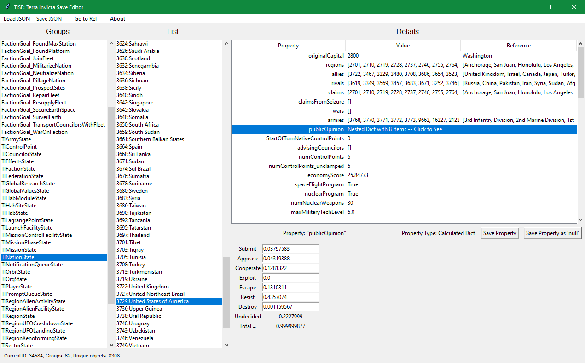
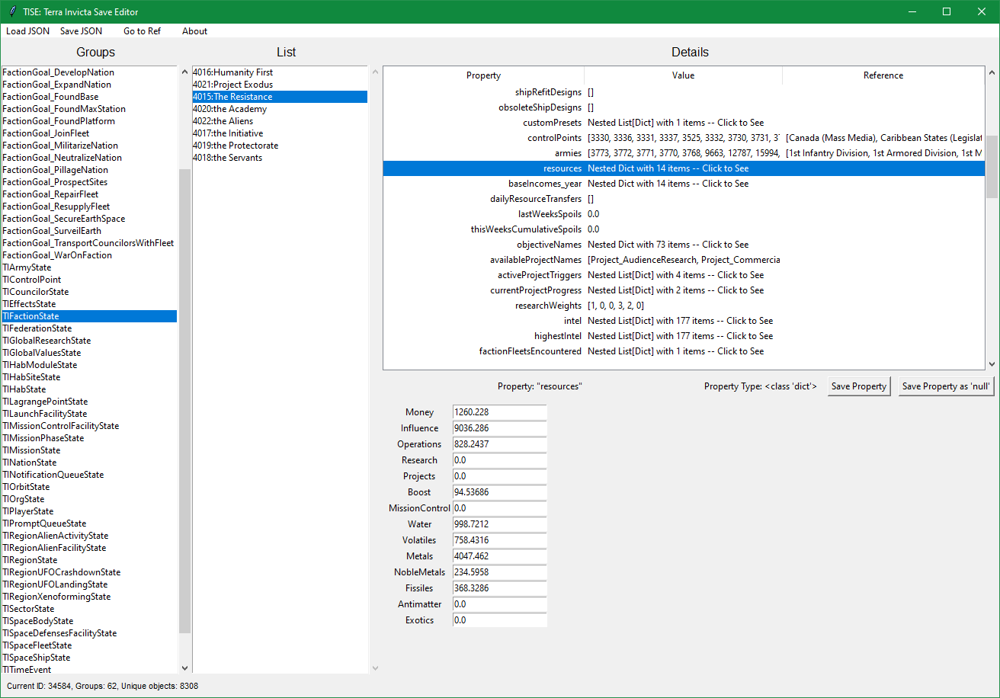

# TISE: Terra Invicta Save Editor

A fast, cross-platform save editor for Terra Invicta, written in Rust.

## Disclaimer

This software is provided as-is. Please back up your save files before making changes. Use at your own risk.

Game version note: Terra Invicta versions `0.4.60` to `0.4.63` can produce corrupted save files, and TISE may be unable to open them.

## Features

- **Robust File Support**
    - Reads and writes Terra Invicta uncompressed `.json` and compressed `.gz` saves.
    - Supports JSON5 features used by the game (`Infinity`, `NaN`, comments, trailing commas).
    - Preserves Terra Invicta save formatting quirks; loading and saving without edits should produce identical output.
- **Navigation & Search**
    - Browse the game state via **Groups** and **Objects**.
    - **Search Items**: deep scan all keys and values.
    - **Search References**: find objects by ID or name.
    - **Go to ID**: jump directly to an object by its integer ID.
    - **Go to Ref**: one-click navigation for relational references (e.g. `{ value: 12345 }`).
    - **History**: navigate Back (`Alt+Left`) and Forward (`Alt+Right`).
- **Editing**
    - Edit values (booleans, numbers, strings) directly.
    - Edit complex objects/arrays in the object editor or as JSON text.
    - Undo/Redo support.
    - Special-case helper: public opinion editing will auto-calculate the remaining “Undecided” value so the total sums to 1.
- **Performance & UI**
    - Handles large saves smoothly.
    - Cross-platform native UI powered by `egui`.
    - Light/Dark theme toggle.

## Usage

- Download the latest release binary from GitHub Releases.
- Open TISE, click **Load Game**, and select your save file.
- Navigate via **Groups** → **Objects**, then edit properties.
- Use **Save Property** (per-field) and **Save JSON** (write the modified save).

### Public Opinion editing example

To edit a nation, select **TINationState**, pick a nation, then select the **publicOpinion** property:



You can edit any of the values manually or click-and-drag the handy pie chart. TISE will compute the remaining **Undecided** value for you.

### Editing a faction example

To edit factions, select **TIFactionState** and pick a faction. For example, to edit faction resources, select the **resources** property:



## Object References and Technical Explanation

Terra Invicta save files are JSON and behave like “relational JSON objects”: each object has a unique integer ID and lives inside a type-group. Objects can reference other objects by embedding a dictionary containing a special `value` field:

```json
"OurGroupName": [
    {
        "Key": {
            "value": 12345
        },
        "Value": {
            "ID": {
                "value": 12345
            },
            "$type": "OurGroupName",
            "displayName": "Friendly Name for the Object",
            "somedict": {
                "x": 1.0,
                "y": 2.0,
                "z": 3.0
            },
            "somebool": true,
            "someattribute": 69,
            "someotherobject": {
                "value": 98765
            }
        }
    }
]
```

Each object within a group is guaranteed to always have the same properties within its "Value" section. This example object with ID 12345 of the "OurGroupName" group references another object, ID 98765, in its "someotherobject" property -- references to other objects are nested dictionaries with a special "value" (lowercase V!) property. (The "Key.value" int and the "Value.ID.value" int appear to be redundant info.)

 --> 

For a practical example in this save game, ID 3861 is an object in the "TIControlPoint" group (Canada's Executive Control Point). It has a property named "faction", which is the faction it belongs to. However, the value of this property isn't "the Academy" -- instead it is `{"value":4817}`. If you click the "Go" button next to any reference type, you will be brought to the Properties panel for that ID, which in this save game is in the "TIFactionState" group, belonging to "the Academy".

## Build & Run

Install Rust: https://rustup.rs/

```bash
cargo run --release
```

## Development

This repo uses `rustfmt` and `clippy`.

```bash
cargo fmt --all
cargo clippy --all-targets -- -D warnings
cargo test
```

## License

This project is licensed under the terms of the GPLv2 license.

## Contributions

I'm not planning further updates, but feel free to submit pull requests if you want something added.
